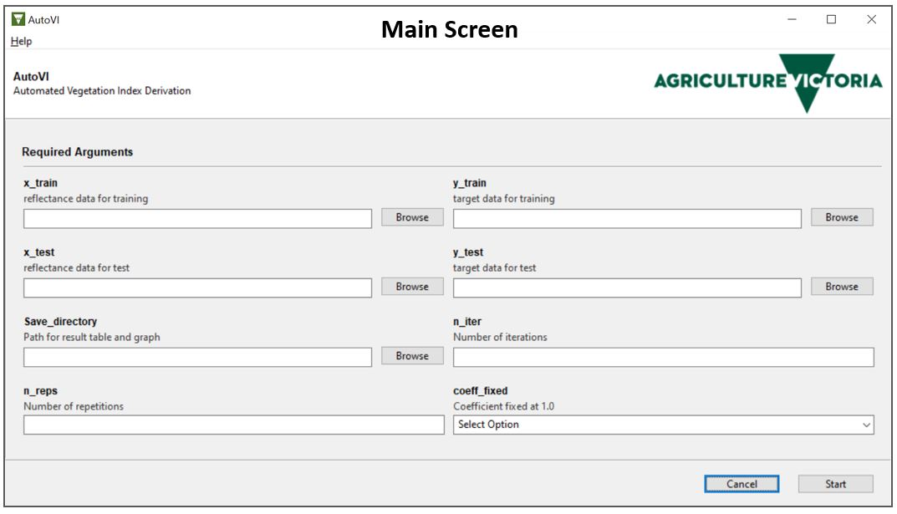

# AutoVI Repository
This repository provides instructions for the installation of the AutoVI software, source codes and datasets reported in the manuscript 'Automated 
hyperspectral vegetation index derivation using a hyperparameter optimization framework for high-throughput plant phenotyping'.

## AutoVI Installation
1. [Download the AutoVI windows installer](https://forms.gle/gwPstCCSHtSK5ypC7). Run AutoVI_setup to install AutoVI software. 
2. Please refer to the User Manual.pdf under AutoVI folder for further instructions. 

## Source Codes & Datasets
All relevant source codes & datasets used in the manuscript can be found under these folders: 
* Chlorophyll - source codes and datasets for chlorophyll content estimation
* Sugar - source codes and datasets for sugar content estimation
* AutoVI - user manual and TPE implementation for AutoVI software

## System Requirements
* Windows 10 64-bit operating system 
* Modern x86 CPU (we recommend octacore or better)
* 16 GB RAM (we recommend 32 GB or better)
* 1 GB disk / storage space

## License
The AutoVI software is distributed under the [Creative Commons Attribution-NonCommercial-NoDerivatives 4.0 International
license.](https://creativecommons.org/licenses/by-nc-nd/4.0/)  

## Reference
Joshua C.O. Koh, Bikram P. Banerjee, German Spangenberg, Surya Kant. 'Automated hyperspectral vegetation index derivation
 using a hyperparameter optimization framework for high-throughput plant phenotyping'.
   

 
